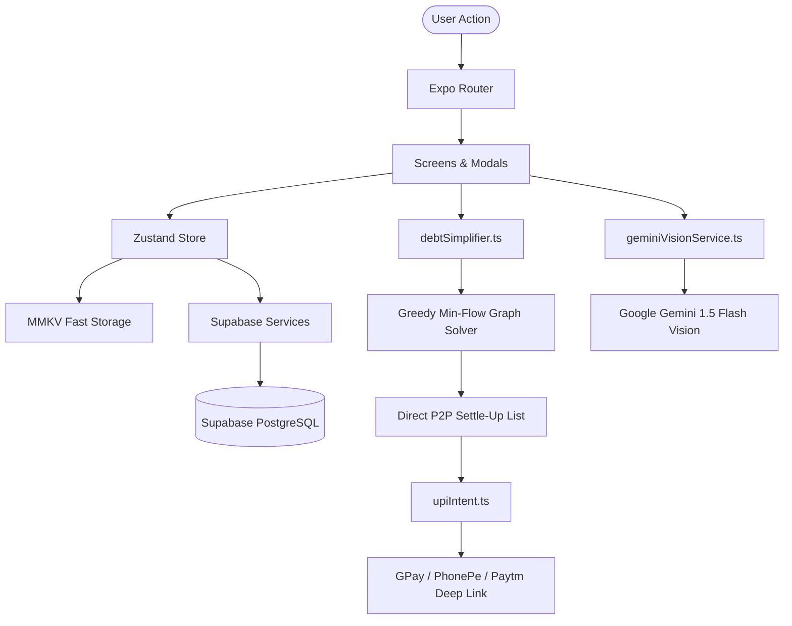

<div align="center">

# FairShare

**The Neo-Fintech Expense Sharing & P2P Settlement Engine**

*AI-Powered Receipt Itemization | Greedy Min-Flow Debt Simplification | Zero-Fee Direct UPI Settlements*

<br/>

[](https://github.com/lk-03/FairShare/stargazers)
[](https://github.com/lk-03/FairShare/network/members)
[](https://github.com/lk-03/FairShare/issues)
[](LICENSE)

<br/>

[](https://expo.dev)
[](https://reactnative.dev)
[](https://www.typescriptlang.org)
[](https://supabase.com)
[](https://ai.google.dev)
[](https://nativewind.dev)
[](https://github.com/mrousavy/react-native-mmkv)

</div>

---

## Overview

**FairShare** is a next-generation mobile financial application engineered to eliminate the friction of shared expenses, cyclic group debts, and awkward manual calculations. 

Built with React Native, Expo Router, Supabase, and Google Gemini AI, FairShare combines automated receipt OCR itemization, graph-theoretical debt reduction, and zero-fee peer-to-peer UPI settlements into a unified, high-performance experience.

---

## Core Capabilities

### 1. AI-Powered Receipt Itemizer (Google Gemini Vision)
- **Multi-Modal Intake**: Capture physical receipts via camera, attach photo screenshots, or upload PDF invoice documents.
- **Automated Breakdown**: Leverages Google Gemini 1.5 Flash Vision to parse merchant titles, line items, unit quantities, subtotal amounts, service charges, and taxes.
- **Granular Assignment**: Assign individual bill items to specific group members with a single tap, auto-distributing proportional tax and tips.

### 2. Smart Greedy Min-Flow Debt Simplification
- **Graph Reduction**: Eliminates circular IOUs across multi-person cohorts (e.g., A owes B, B owes C, C owes A) and condenses them into the mathematical minimum number of direct payments.
- **Self-Balancing Ledger**: Solo expenses and self-funded transactions automatically resolve to net zero without corrupting group balances.

### 3. Zero-Fee Direct UPI P2P Settlements
- **Universal Deep Linking**: Directly triggers native banking and UPI apps (Google Pay, PhonePe, Paytm, BHIM, CRED) using standardized `upi://pay` OS intent URLs.
- **Pre-Populated Verification**: Automatically embeds payee Virtual Payment Addresses (VPAs), settlement amounts, and transaction notes to prevent manual typing errors.

### 4. Advanced Split Allocation Engine
FairShare provides five distinct splitting mechanics to adapt to any real-world spending scenario:
- **Equal Split**: Even division across all selected members.
- **Exact Rupee Amounts**: Allocate precise amounts per person with dynamic real-time discrepancy auto-fill.
- **Percentages**: Allocate custom percentages with automatic 100% remainder balancing.
- **Shares / Ratios**: Weighted splitting (e.g., 2 shares for couples, 1 share for singles).
- **Adjustments**: Base split combined with individual plus/minus rupee modifiers.

### 5. House Cart & Shared Needs Checklist
- **Roommate Collaboration**: Real-time shared shopping checklist for house staples, groceries, and pantry needs.
- **Auto-Expiry Cleaning**: Completed items automatically purge after 5 days to keep lists clean.
- **Personalized Reminders**: Customizable recurring reminder schedules for quick-commerce runs.

### 6. One-Tap Splitwise CSV Migration
- Seamlessly import full historical data from Splitwise exports.
- Preserves all group memberships, historical expenses, payer records, and split weightings.

### 7. Dynamic Multi-Theme Engine
- Custom-tailored color schemes: Classic Dark, Pure Midnight Black, Cyber Neon, Rose Gold, and Clean Light.
- Full system dark/light mode synchronization.

---

## Architecture & Data Flow



---

## Tech Stack

| Layer | Technology | Purpose |
| :--- | :--- | :--- |
| **Framework** | Expo SDK 57 / React Native 0.76 | Cross-platform mobile runtime |
| **Routing** | Expo Router v57 | File-based typed routing |
| **Language** | TypeScript 5.3+ | End-to-end type safety |
| **Backend & DB** | Supabase (PostgreSQL 15) | Relational store, Auth & RLS security |
| **AI / OCR** | Google Gemini 1.5 Flash Vision | On-device image & receipt tokenization |
| **State & Cache** | Zustand + MMKV | High-speed offline-first state persistence |
| **Styling** | NativeWind v4 (Tailwind CSS) | Dynamic theme-reactive utility styling |
| **Payments** | UPI Intent Protocol (`upi://pay`) | Zero-fee direct bank-to-bank settlement |

---

## Getting Started

### Prerequisites
- Node.js 18.x or later
- npm or yarn
- Expo Go app on mobile device OR Android Studio / Xcode for native compilation

### Installation

1. **Clone the repository**:
   ```bash
   git clone https://github.com/lk-03/FairShare.git
   cd FairShare
   ```

2. **Install dependencies**:
   ```bash
   npm install
   ```

3. **Configure Environment Variables**:
   Copy the example environment template:
   ```bash
   cp .env.example .env
   ```

   Fill in your API credentials in `.env`:
   ```env
   # Supabase Configuration
   EXPO_PUBLIC_SUPABASE_URL=https://your-project.supabase.co
   EXPO_PUBLIC_SUPABASE_ANON_KEY=your-anon-key

   # Google Generative AI (Gemini Flash Vision)
   EXPO_PUBLIC_GEMINI_API_KEY=your-gemini-api-key

   # Google OAuth Native Web Client ID
   EXPO_PUBLIC_GOOGLE_WEB_CLIENT_ID=your-google-client-id.apps.googleusercontent.com
   ```

4. **Run Database Migrations**:
   Execute the migration SQL script located in `supabase/migrations/20260830_initial_schema.sql` inside your **Supabase SQL Editor** to generate all relational tables, indexes, triggers, and Row Level Security policies.

5. **Start Development Server**:
   ```bash
   npx expo start
   ```

---

## Running Tests

FairShare includes comprehensive unit tests verifying the debt simplification graph solver, receipt tokenizers, Splitwise CSV parser, and UPI intent generators:

```bash
# Run test suite
npm test

# Type check TypeScript codebase
npx tsc --noEmit
```

---

## Star History

<div align="center">

[](https://star-history.com/#lk-03/FairShare&Date)

</div>

---

## License

Distributed under the MIT License. See [LICENSE](LICENSE) for more details.
