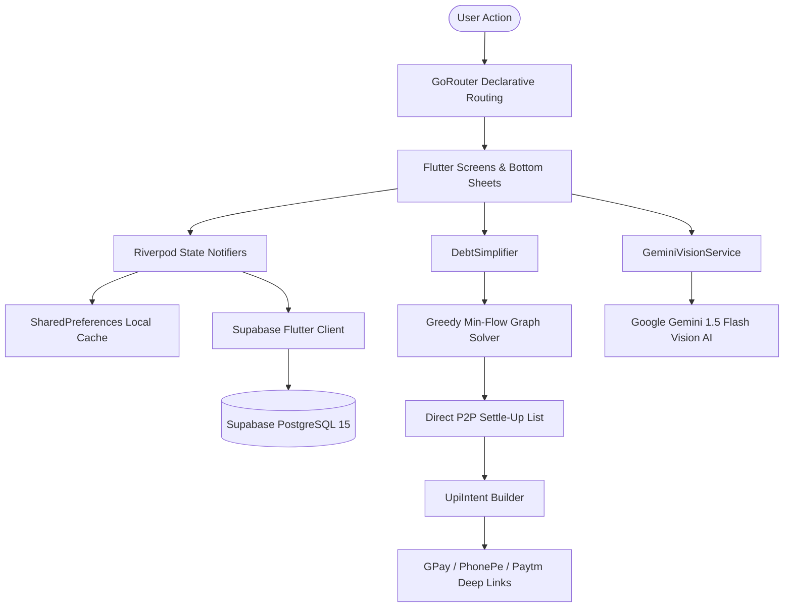

<div align="center">

# FairShare

**The Neo-Fintech Expense Sharing & P2P Settlement Engine**

*AI-Powered Receipt Itemization | Multi-Payer Min-Flow Debt Simplification | Zero-Fee Direct UPI Settlements*

<br/>

[](https://github.com/lk-03/FairShare/stargazers)
[](https://github.com/lk-03/FairShare/network/members)
[](https://github.com/lk-03/FairShare/issues)
[](LICENSE)

<br/>

[](https://flutter.dev)
[](https://dart.dev)
[](https://riverpod.dev)
[](https://pub.dev/packages/go_router)
[](https://supabase.com)
[](https://ai.google.dev)
[](https://pub.dev/packages/fl_chart)
[](https://npci.org.in)

</div>

---

## Overview

**FairShare** is a next-generation mobile financial application engineered to eliminate the friction of shared expenses, cyclic group debts, awkward reminders, and manual bill splitting.

Engineered with **Flutter**, **Riverpod**, **GoRouter**, **Supabase**, and **Google Gemini Flash Vision AI**, FairShare combines real-time camera receipt OCR itemization, graph-theoretical debt reduction, multi-payer split allocation, and zero-fee peer-to-peer UPI settlements into a high-performance Scandinavian minimalist fintech experience.

---

## Core Capabilities

### 1. AI-Powered Receipt OCR Itemizer (Google Gemini Vision)
- **Multimodal Intake**: Capture physical receipts directly via camera or select images from the gallery.
- **Automated Extraction**: Uses Google Gemini 1.5 Flash Vision to extract merchant title, date, currency, line items, and total amount with structured JSON tokenization.
- **1-Tap Population**: Automatically populates expense details into the streamlined creation flow with instant receipt thumbnail preview.

### 2. Multi-Payer Greedy Min-Flow Debt Simplification
- **Graph Reduction Algorithm**: Resolves complex, circular multi-person IOUs (e.g., A owes B, B owes C, C owes A) down to the mathematical minimum number of direct peer-to-peer transactions.
- **Multi-Payer Support**: Supports expenses funded across multiple group members with custom split proportions and self-balancing net ledgers.

### 3. Zero-Fee Direct UPI P2P Settlements
- **Standard OS Deep Linking**: Triggers native Indian banking and payment apps (Google Pay, PhonePe, Paytm, BHIM, CRED) using standard `upi://pay` deep link intent protocols without payment gateway fees.
- **Pre-Populated Verification**: Automatically embeds recipient VPAs, settlement amounts, and transaction tags to eliminate human entry errors.
- **Dynamic Settlement QR Codes**: Generates high-resolution vector QR codes for instant scan-and-pay from other devices or gallery imports.

### 4. Minimalist & Intuitive Expense Creation Flow
Redesigned for zero visual clutter with focused sub-sheets:
- **Hero Amount Input**: Prominent currency display with real-time formatting.
- **Interactive Sentence Card**: Natural language interface: *"Paid by [Payer ▾] and split [equally ▾]"*.
- **Dedicated Payer Sheet**: 1-tap single person selection or multi-payer input with a real-time discrepancy ticker.
- **Dedicated 4-Mode Split Sheet**: Effortlessly toggle between **Equally**, **Unequally**, **Percent**, and **Shares** with a live balance discrepancy bar and auto-fill remainder shortcuts.

### 5. Visual Spending Analytics & Trends
- **Dual-Metric Cards**: Side-by-side comparison of total group spend vs your personal financial share.
- **Interactive Donut Chart**: Category expenditure visualization powered by `fl_chart`.
- **Member Contribution Matrix**: Transparent breakdown comparing what each member paid against their fair share.

### 6. Bilateral Member Profile Inspection
- Tap any member avatar across group ledgers to inspect direct bilateral debts (`YOU OWE THEM`, `THEY OWE YOU`, or `ALL SETTLED UP`).
- Includes one-tap UPI settlement button and clipboard VPA copy.

### 7. House Cart & Shared Needs Checklist
- **Shared Shopping Coordination**: Live roommate checklist for groceries, staples, and supplies.
- **5-Day Grace Period Expiry**: Completed items automatically purge after 5 days.
- **Personalized Reminders**: Configurable reminder intervals (hours/days) and presets for shopping runs.

### 8. Scandinavian "Nordic Blue" Design System
- Understated minimalist fintech palette inspired by Revolut and Scandinavian design.
- Full dynamic Material 3 support for Dark Mode, Light Mode, and System appearance.

---

## Architecture & Data Flow



---

## Tech Stack

| Layer | Technology | Purpose |
| :--- | :--- | :--- |
| **Framework** | Flutter 3.47.2 (Dart 3.13.2) | Cross-platform high-performance client runtime |
| **State Management** | Flutter Riverpod 2.6.1 | Compile-safe reactive state architecture |
| **Routing** | GoRouter 14.8.1 | Declarative URL-driven navigation with auth guards |
| **Backend & Auth** | Supabase Flutter 2.8.4 | PostgreSQL 15, Auth, Row Level Security (RLS) |
| **AI / OCR** | Google Generative AI (`google_generative_ai`) | Multimodal receipt invoice tokenization via Gemini 1.5 Flash |
| **Visual Analytics** | `fl_chart` 1.1.1 | 60fps dynamic spending donut charts |
| **Camera & Media** | `image_picker` 1.1.2 | High-resolution receipt image capture |
| **QR Generation** | `qr_flutter` 4.1.0 | High-resolution vector settlement & invite QR codes |
| **Local Persistence** | `shared_preferences` 2.5.4 | Offline-first ledger and profile caching |
| **Payments** | UPI Intent Protocol (`upi://pay`) | Zero-fee direct peer-to-peer bank settlement |

---

## Directory Structure

```
FairShare/
├── android/               # Native Android Gradle configuration (SDK 36)
├── ios/                   # Native iOS Runner configuration
├── linux/                 # Desktop Linux embedder
├── macos/                 # Desktop macOS embedder
├── web/                   # Web embedder
├── windows/               # Desktop Windows embedder
├── assets/                # Application brand assets and icons
├── supabase/              # PostgreSQL schemas, RLS policies, and Edge Functions
├── .github/               # CI test runner and automated APK build workflows
├── .misc/                 # Gitignored: architecture guides, rules, & reference code
├── lib/                   # Flutter Application Root
│   ├── main.dart          # Application entrypoint with ProviderScope & Theme binding
│   ├── config/            # Routes (GoRouter) and Material 3 ThemeExtensions
│   ├── core/              # Models, Debt Simplifier algorithm, UPI Intent utilities
│   ├── data/              # Supabase services, offline repositories, Riverpod providers
│   └── features/          # Feature presentation layers (activity, auth, expenses, groups, home, needs, onboarding, profile)
├── test/                  # 100% Passing Unit & Widget Test Suites (96 tests)
├── .env.example           # Environment variable template
├── analysis_options.yaml  # Flutter strict linter configuration
└── pubspec.yaml           # Flutter dependencies and asset manifest
```

---

## Getting Started

### Prerequisites
- **Flutter SDK**: 3.47.2 or later
- **Dart SDK**: 3.13.2 or later
- **Android Studio** (with Android SDK 36) or **Xcode** (for iOS)
- Physical device or emulator/simulator

### Installation

1. **Clone the repository**:
   ```bash
   git clone https://github.com/lk-03/FairShare.git
   cd FairShare
   ```

2. **Install Flutter dependencies**:
   ```bash
   flutter pub get
   ```

3. **Configure Environment Variables**:
   Create a local `.env` file from the template:
   ```bash
   cp .env.example .env
   ```

   Add your credentials to `.env` (this file is gitignored and will never be committed):
   ```env
   # Supabase Backend Configuration
   EXPO_PUBLIC_SUPABASE_URL=https://your-project.supabase.co
   EXPO_PUBLIC_SUPABASE_ANON_KEY=your-anon-key
   SUPABASE_URL=https://your-project.supabase.co
   SUPABASE_ANON_KEY=your-anon-key

   # Google OAuth Native Client ID
   EXPO_PUBLIC_GOOGLE_WEB_CLIENT_ID=your-client-id.apps.googleusercontent.com
   GOOGLE_WEB_CLIENT_ID=your-client-id.apps.googleusercontent.com

   # Google Gemini Flash Vision API Key (Free tier from Google AI Studio)
   EXPO_PUBLIC_GEMINI_API_KEY=your-gemini-api-key
   GEMINI_API_KEY=your-gemini-api-key
   ```
   *(Note: FairShare includes full offline-first fallbacks and demo login; you can run the app locally even without cloud credentials).*

4. **Run the Application**:
   ```bash
   # Run on connected device or default simulator
   flutter run

   # Or run on Google Chrome (Web preview)
   flutter run -d chrome
   ```

---

## Running Quality Checks & Tests

FairShare includes comprehensive unit and widget tests covering all business logic, Riverpod state notifiers, algorithmic debt reduction, and UI forms:

```bash
# Static analysis (0 warnings, 0 errors)
flutter analyze

# Run all 96 unit and widget tests
flutter test
```

---

## Building Android Release APK

```bash
flutter build apk --release
```
The compiled standalone APK will be generated at:
`build/app/outputs/flutter-apk/app-release.apk`

---

## Star History

<div align="center">

[](https://star-history.com/#lk-03/FairShare&Date)

</div>

---

## License

Distributed under the MIT License. See [LICENSE](LICENSE) for more details.
