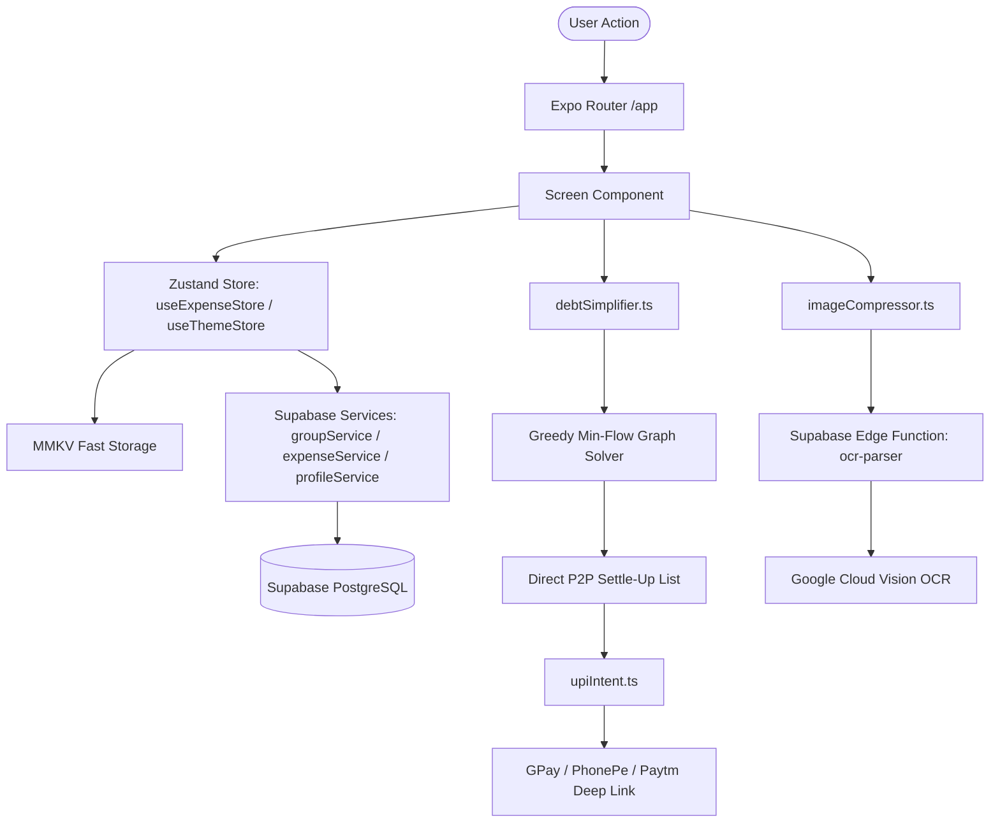

# FairShare — AI Context & Codebase Architecture Guide

> **CRITICAL RULE FOR ALL AI ASSISTANTS:**
> Whenever you add, modify, rename, or delete any files, or make architectural/state changes to this project, you **MUST** update this file (`ai-context.md`) to keep the documentation synchronized and accurate.

---

## 1. Executive Summary & Project Goals

**FairShare** is a neo-fintech mobile application built with **React Native (Expo)**, **TypeScript**, **NativeWind v4**, **Zustand (MMKV)**, and **Supabase**. It is designed to modernize group expense tracking, bill splitting, and peer-to-peer settlement.

### Core Goals & Features
1. **Smart Debt Simplification**: Employs a Greedy Min-Flow Graph algorithm to resolve cyclic multi-person IOUs and reduce $N$-person group debts down to the mathematical minimum number of direct transactions.
2. **Zero-Fee Direct UPI P2P Settlements**: Generates standard OS-level `upi://pay` deep link intents to trigger instant payments via Google Pay, PhonePe, Paytm, BHIM, or CRED directly between bank VPAs without payment gateway fees.
3. **Household & Event Collaboration ("Needs List / Cart of the House")**: Shared checklist for roommates and trip cohorts with automatic 5-day item expiration and personal reminder schedules for quick-commerce shopping runs (Blinkit, Instamart, Zepto, BigBasket).
4. **Visual Spending Trends ("Monthly Spendings")**: Dynamic dual-bar visualization comparing total group expenditure against the individual user's personal share across billing cycles.
5. **Flexible Split Allocation Engine**: Supports four granular split modes: Equal splits, Exact rupee amounts (with real-time remaining auto-fill), Percentages (with 100% remaining auto-fill), and Custom share weightings/ratios.
6. **Receipt Compression & OCR Invoice Extraction**: Automated receipt photo compression via `expo-image-manipulator` and a Supabase Edge Function integrating Google Cloud Vision OCR for invoice breakdown.
7. **Offline-First Persistence**: High-speed local caching using **MMKV** with an in-memory fallback for Expo Go and Web environments.
8. **QR-Based Cohort Onboarding**: Camera QR code scanning and direct deep linking (`fairshare://join/<inviteCode>`) for zero-friction group joining.

---

## 2. Visual Theme & Aesthetic System

FairShare incorporates a **Revolut-inspired neo-fintech aesthetic**, featuring multi-stop curved SVG gradient headers, frosted accent pills, rounded elevated surface cards, and a dual-dimension theme engine:

### Theme Matrix (4 Palettes $\times$ 2 Modes $\times$ System Preference)
- **Nordic Steel** *(Default)*: Clean Scandinavian steel blue and midnight slate.
- **Muted Sage**: Organic eucalyptus and deep pine forest tones.
- **Warm Taupe**: Cozy sand and mocha clay.
- **Electric Cobalt**: Vibrant royal blue fintech theme.
- **Modes**: `Light`, `Dark`, and automatic `System` scheme detection.

All themes are configured through CSS custom variables declared in `src/global.css` and exposed through `tailwind.config.js`.

---

## 3. Detailed Description of Every File in the Project

```
FairShare/
├── Configuration & Setup
├── supabase/ (Database & Edge Functions)
├── scripts/ (Automation & Setup)
└── src/
    ├── types/ (TypeScript Domain Models)
    ├── constants/ (Styling & Design Tokens)
    ├── store/ (Zustand State Stores & Persistence)
    ├── services/ (Supabase, Storage, UPI Intents)
    ├── utils/ (Debt Simplifier, Image Compression)
    ├── hooks/ (Theme & Color Scheme Hooks)
    ├── components/
    │   ├── ui/ (Atomic Design Primitives & EmptyState)
    │   └── [Modals & Feature Tabs]
    └── app/ (Expo Router File-Based Routing)
```

---

### Root Configuration & Documentation Files

#### `package.json`
- **Role:** Defines project metadata, build scripts (`start`, `android`, `ios`, `web`, `lint`, `test`), npm dependencies, and dev tooling.
- **Key Dependencies:**
  - `expo` (~57.0.10) & `expo-router` (~57.0.10)
  - `nativewind` (^4.2.6) & `tailwindcss` (^3.4.19)
  - `zustand` (^5.0.3) & `react-native-mmkv` (^3.2.0)
  - `@supabase/supabase-js` (^2.48.1)
  - `expo-camera`, `expo-image`, `expo-image-manipulator`, `expo-image-picker`
  - `react-native-reanimated` (4.5.1), `react-native-svg` (15.15.4), `qrcode` (^1.5.4)

#### `app.json`
- **Role:** Expo Application Configuration manifest.
- **Details:** Sets app name (`FairShare`), package ID (`com.fairshare.app`), scheme (`fairshare`), splash screen branding (`#0B1220` with `./assets/images/splash-icon.png`), adaptive Android icons (`#0B1220`), and enables experimental features: `typedRoutes` and `reactCompiler`.

#### `tailwind.config.js`
- **Role:** Tailwind CSS / NativeWind configuration.
- **Details:** Scans `./src/**/*.{js,jsx,ts,tsx}` and maps custom CSS theme variables (`--bg-screen`, `--bg-surface`, `--border-surface`, `--text-main`, `--text-secondary`, `--text-positive`, `--text-negative`, `--accent-pill`) to Tailwind utility classes.

#### `babel.config.js`
- **Role:** Babel compiler configuration.
- **Details:** Applies `babel-preset-expo` with `jsxImportSource: "nativewind"` and registers the `nativewind/babel` plugin for ahead-of-time className-to-style compilation.

#### `metro.config.js`
- **Role:** Metro bundler configuration for Expo.
- **Details:** Wraps the default Metro configuration with `withNativeWind(config, { input: "./src/global.css" })` to process stylesheet transformations.

#### `tsconfig.json`
- **Role:** TypeScript compiler settings.
- **Details:** Extends `expo/tsconfig.base`, enables `strict` mode, sets module path aliases (`@/*` $\rightarrow$ `./src/*`, `@/assets/*` $\rightarrow$ `./assets/*`), and excludes Supabase Deno Edge functions.

#### `jest.config.js`
- **Role:** Jest unit test configuration.
- **Details:** Configures `ts-jest` for Node testing environment, maps `@/` path aliases, and mocks React Native modules using `src/__mocks__/react-native.js`.

#### `ai-rules.md`
- **Role:** Project AI coding standards and guidelines.
- **Details:** Outlines NativeWind v4 rules (no `StyleSheet.create`, flexbox-only layout, token usage), state preservation rules (Zustand & Supabase immutability), file structure conventions, and requirement to update `ai-context.md`.

#### `AGENTS.md` & `CLAUDE.md`
- **Role:** Agent instruction files instructing LLM agents to reference Expo v57 docs.

#### `README.md` & `LICENSE`
- **Role:** Standard repository documentation and MIT License.

#### `.github/workflows/build-apk.yml` & `.github/workflows/ci.yml`
- **Role:** Automated CI and Android APK build pipelines.
- **Features:** Builds release and debug APKs via `npx expo prebuild --no-install` and `./gradlew assembleRelease` on Ubuntu runners with Node 20, JDK 17, and Android SDK. Uploads APKs to GitHub Artifacts and automatically publishes to **GitHub Releases** (supports manual workflow dispatch with tag input or git tag push).

#### Type Declaration Files: `env.d.ts`, `expo-env.d.ts`, `nativewind-env.d.ts`, `src/global.d.ts`
- **Role:** TypeScript declaration headers providing ambient type references for Expo types, NativeWind className props, and CSS module imports (`*.module.css`).

---

### Backend & Cloud Database (`supabase/`)

#### `supabase/schema.sql` & `supabase/migrations/`
- **Role:** PostgreSQL database schema definitions and versioned migrations with Row Level Security (RLS) for Supabase.
- **Key Tables:**
  1. `profiles`: User accounts, avatars, UPI VPA IDs (`vpa_id`), `@username`, and auth provider.
  2. `cohorts`: Groups with categories, custom icons, invite codes, currencies, archive flags (`is_archived`, `archived_at`), and 15-day trash deletion flags (`is_deleted`, `deleted_at`).
  3. `group_members`: Membership joins with roles (`admin`, `member`), kick permissions, and admin succession support.
  4. `expenses`, `expense_splits`, `line_items`, `line_item_assignments`: Multi-mode expense engine and itemized OCR receipt records.
  5. `comments`: Expense and cohort-level activity/system event discussions.
  6. `shared_list_items` & `expense_shortcuts`: Shared House Cart checklist and 1-tap repetitive bill shortcuts.
- **Migrations:**
  - `supabase/migrations/20260830_initial_schema.sql`: Full baseline schema with RLS, triggers, and Storage buckets (`receipts`, `avatars`).
  - `supabase/migrations/20260902_group_deletion_and_admin_succession.sql`: Migration for `is_archived`, `archived_at`, `is_deleted`, `deleted_at`, nullable `expense_id` with `cohort_id` on `comments`, cohort deletion policies, and member kick/succession RLS policies.

#### `supabase/functions/ocr-parser/index.ts`
- **Role:** Deno-based Supabase Edge Function for automated receipt OCR.
- **Details:** Accepts base64 encoded receipt images, connects to Google Cloud Vision API (`DOCUMENT_TEXT_DETECTION`), extracts text, executes regex-based total price extraction, and falls back to mock parsing if no API key is provided.

---

### Utility Scripts & Mocks

#### `scripts/reset-project.js`
- **Role:** Expo boilerplate cleanup script that can move starter templates to `/example` and generate clean `src/app/index.tsx` and `src/app/_layout.tsx` templates.

#### `src/__mocks__/react-native.js`
- **Role:** Jest mock for React Native environment, mocking `Platform`, `Linking` (`canOpenURL`, `openURL`), and `StyleSheet`.

---

### Domain Types & Styling System

#### `src/types/index.ts`
- **Role:** Core TypeScript domain definitions for the entire application.
- **Key Types:**
  - `SplitType`: `'equal' | 'exact' | 'percentage' | 'shares'`
  - `EventCategory`: `'trip' | 'house' | 'event' | 'dining' | 'transport' | 'utilities' | 'custom'`
  - `UserProfile`, `EventCohort`, `GroupMember`, `Expense`, `ExpenseSplit`, `LineItem`, `TransactionComment`
  - `DebtSimplificationResult` & `DirectDebt`: Structures for simplified P2P settlement graphs.
  - `UPIPaymentConfig`: Payee VPA, amount, note, and transaction parameters.
  - `SharedListItem` & `PersonalReminderSettings`: Household needs list items and reminder configs.

#### `src/constants/theme.ts`
- **Role:** Design token constants.
- **Details:** Exports base color constants, `CHART_PALETTE` array, platform-specific font family mappings (`ios`, `default`, `web`), standard spacing scale (`Spacing.half` to `Spacing.six`), and `BottomTabInset` metrics.

#### `src/global.css`
- **Role:** Global stylesheet and NativeWind component layer.
- **Details:**
  - Declares font families (`--font-display`, `--font-mono`, etc.) and chart tokens (`--chart-1` through `--chart-8`).
  - Configures 8 CSS theme classes (`.theme-nordic-dark`, `.theme-nordic-light`, `.theme-sage-dark`, `.theme-sage-light`, `.theme-taupe-dark`, `.theme-taupe-light`, `.theme-cobalt-dark`, `.theme-cobalt-light`).
  - `@layer components` definitions: `.screen-header`, `.card-main`, `.card-item`, `.card-group`, `.card-group-item`, `.group-card-title`, `.group-card-desc`, `.group-card-members`, `.fab-backdrop`, `.fab-speed-dial-menu`, `.fab-speed-dial-item`, `.fab-speed-dial-label`, `.fab-speed-dial-icon-qr`, `.fab-speed-dial-icon-add`, `.fab-main-btn`, `.btn-primary-dark`, `.btn-outline-light`, `.btn-icon-circle`, `.balance-positive`, `.balance-negative`, `.bottom-nav-bar`, and chart legend dot utility classes (`.chart-dot-1` through `.chart-dot-8`).

---

### State Management & Persistence (`src/store/`)

#### `src/store/useThemeStore.ts`
- **Role:** Zustand store managing visual theme selection and appearance mode.
- **Details:**
  - State: `themeBase` (`'nordic' | 'sage' | 'taupe' | 'cobalt'`), `colorScheme` (`'light' | 'dark' | 'system'`).
  - Persisted using MMKV storage via key `fairshare-theme-store`.
  - Exports theme metadata, preview hex codes, gradient stops (`THEME_GRADIENTS`), and helper functions: `getActiveThemeClass()` and `getThemeGradientColors()`.

#### `src/store/useExpenseStore.ts`
- **Role:** Central domain Zustand store with asynchronous Supabase sync, loading states, error handling, and MMKV offline-first persistence.
- **Details:**
  - Manages `currentUser`, `cohorts`, `members`, `expenses`, `comments`, `sharedLists`, `reminderSettings`, `isLoading`, `isSyncing`, `error`, and `offlineQueue`.
  - Async Actions: `fetchInitialData` (fetches user, cohorts, members, expenses, shortcuts, and shared house needs in parallel), `fetchCohorts`, `fetchExpensesForCohort`, `refreshAll` (parallel multi-resource refresh), `addCohort`, `updateCohort`, `joinCohortByInviteCode`, `addExpense`, `updateExpense`, `deleteExpense`, `addComment`, `addShortcut`, `addListItem`, `clearError`.
  - Persisted using MMKV via key `fairshare-store-v1` with `partialize` configuration.

#### `src/store/useAlertStore.ts`
- **Role:** Global alert and action sheet state manager and universal `showAlert()` trigger helper.
- **Details:** Replaces un-themeable native OS `Alert.alert` popups with customized, theme-reactive modal dialogs and multi-button action sheets matching FairShare design tokens. Supports button styles (`default`, `cancel`, `destructive`), custom icons, auto-dismiss, and drop-in compatibility with standard `Alert.alert(title, message, buttons)` calls.

---

### Services & Data Layer (`src/services/`)

#### `src/services/supabase/placeholderData.ts`
- **Role:** Clean production baseline defaults for fresh initialization.
- **Data:** `DEFAULT_CURRENT_USER` (clean empty profile), `DEFAULT_COHORTS` (`[]`), `DEFAULT_MEMBERS` (`{}`), `DEFAULT_EXPENSES` (`{}`), `DEFAULT_SHORTCUTS` (`{}`), `DEFAULT_SHARED_LISTS` (`{}`), `DEFAULT_REMINDER_SETTINGS` (`{}`).

#### `src/services/supabase/profileService.ts`
- **Role:** Profile fetching and updating operations via Supabase `profiles` table.
- **Functions:** `fetchProfile`, `updateProfile`, `getCurrentProfile`.

#### `src/services/supabase/client.ts`
- **Role:** Supabase JS client initializer and configuration checker.
- **Details:** Configures client with `EXPO_PUBLIC_SUPABASE_URL` and `EXPO_PUBLIC_SUPABASE_ANON_KEY`, auto-refreshing tokens, exports `isSupabaseConfigured()` guard (preventing network error spam when placeholder credentials are used), and exports `signInAsGuest()` for anonymous authentication.

#### `src/services/supabase/authService.ts`
- **Role:** Authentication engine for Supabase Auth, Native Google Play Services (`@react-native-google-signin/google-signin` configured with `EXPO_PUBLIC_GOOGLE_WEB_CLIENT_ID`), Web OAuth PKCE fallback, and Email verification.
- **Functions:** `signInWithNativeGoogle` (safely checks `NativeModules.RNGoogleSignin` before loading to prevent `TurboModuleRegistry` crashes in Expo Go sandbox while opening native Google Play Services account picker bottom sheets in custom APK/dev builds, exchanging Google ID token with Supabase via `signInWithIdToken`, preserving custom nicknames/handles/VPAs), `signInWithGoogleOAuth`, `signInWithEmail`, `signUpWithEmail`, `resendConfirmationEmail`, `signOut`.

#### `src/services/supabase/profileService.ts`
- **Role:** User profile operations connecting to `profiles` table.
- **Functions:** `fetchProfile`, `updateProfile` (resolves active session user ID to adhere to PostgreSQL RLS policies and executes `.upsert` with fallback without `PGRST116` or `42501` errors, syncing full name, nickname, username, avatar URL, VPA ID, and guest flags), `getCurrentProfile`.

#### `src/services/supabase/groupService.ts`
- **Role:** Cohort and membership queries connecting to `cohorts` and `group_members`.
- **Functions:** `fetchUserCohorts`, `createCohort`, `updateCohort`, `joinCohortByInviteCode`, `addMembersToCohort`.

#### `src/services/supabase/expenseService.ts`
- **Role:** Ledger operations connecting to `expenses`, `expense_splits`, `line_items`, and `comments`.
- **Functions:** `fetchExpensesForCohort`, `createExpense`, `updateExpense`, `deleteExpense`, `fetchCommentsForExpense`, `addComment`.

#### `src/services/supabase/needsService.ts`
- **Role:** Shared House Cart / Needs checklist synchronization connecting to `shared_list_items`.
- **Functions:** `fetchSharedListItems`, `createSharedListItem`, `toggleSharedListItem`, `deleteSharedListItem`.

#### `src/services/supabase/shortcutService.ts`
- **Role:** Group-scoped expense shortcut persistence connecting to `expense_shortcuts`.
- **Functions:** `fetchShortcuts`, `createShortcut`, `deleteShortcut`.

---

### AI Vision & OCR Services (`src/services/ai/`)

#### `src/services/ai/geminiVisionService.ts`
- **Role:** High-accuracy AI vision receipt scanner integrating Google Gemini Flash Vision (`gemini-3.6-flash` / `gemini-flash-latest`) via `EXPO_PUBLIC_GEMINI_API_KEY` on Google AI Studio's Free Tier.
- **Functions:**
  - `preprocessReceiptImage`: Auto-resizes and optimizes receipt image to 1400px width with high contrast JPEG compression via `expo-image-manipulator`.
  - `parseReceiptWithGemini`: Sends base64 image data to Gemini 3.6 Flash Vision with a structured JSON schema, extracting real store/vendor names, dates, item line items with quantities and prices, tax/GST, discounts, and total amounts in ~500ms with fallback handling.

---

### Supabase Backend & Database Migrations (`supabase/`)

#### `supabase/migrations/20260830_initial_schema.sql`
- **Role:** Complete PostgreSQL DDL migration script with relational tables (`profiles`, `cohorts`, `group_members`, `expenses`, `expense_splits`, `line_items`, `line_item_assignments`, `comments`, `shared_list_items`, `expense_shortcuts`), performance indexes on `cohort_id` and `created_at`, Row Level Security (RLS) policies, and storage buckets (`receipts`, `avatars`).

#### `supabase/functions/ocr-parser/index.ts`
- **Role:** Supabase Deno Edge Function for cloud receipt OCR parsing with Google Vision API bridge and deterministic tokenization.

#### `.gitignore`
- **Role:** Repository exclusions preventing leak of secrets, native artifacts, build caches, and AI assistant artifacts (`.claude`, `CLAUDE*.md`, `ai-rules*`, `ai-context*`, `AGENTS.md`, `.cursor`, `.windsurf`, `.cline`, `.gemini`, `brain`, `scratch`, `export.csv`, `.zip`, `.env*`).

#### `README.md`
- **Role:** Comprehensive open-source repository documentation featuring live Shields.io star/fork counters configured for `lk-03/FairShare`, tech stack badges, deep feature breakdowns, Mermaid architecture diagrams, installation and Supabase setup steps, test runners, Star History chart, and zero-emoji compliance.

#### `.github/workflows/ci.yml`
- **Role:** Automated CI pipeline triggered on push/PR running `npx tsc --noEmit` and `npm test` across the full test suite in under 45 seconds.

#### `.github/workflows/build-apk.yml`
- **Role:** Automated Android APK compilation pipeline triggered via manual `workflow_dispatch` button or release tags (`v*`), executing `expo prebuild`, Gradle release compilation, and uploading `FairShare-Release.apk` as a downloadable GitHub artifact and release asset.

---

### Core Algorithms & Utilities (`src/utils/`)

#### `src/utils/debtSimplifier.ts`
- **Role:** Greedy Min-Flow Graph algorithm to simplify multi-party group debts.
- **Logic:**
  1. Computes net position for each member (Credits for paying, Debits for share of splits).
  2. Divides participants into `debtors` (negative balance) and `creditors` (positive balance).
  3. Sorts both lists in descending order of balance.
  4. Greedily pairs the largest debtor with the largest creditor, settling $\min(\text{debtor}, \text{creditor})$ and advancing pointers until all balances reach zero.
- **Test Suite:** `src/utils/__tests__/debtSimplifier.test.ts` verifies pairwise debt resolution and multi-person circular debt elimination ($A \rightarrow B \rightarrow C \rightarrow A$).

#### `src/utils/imageCompressor.ts`
- **Role:** Client-side receipt image compression.
- **Details:** Uses `expo-image-manipulator` to resize invoice photos to max width 1200px and compress to JPEG (0.7 quality), keeping file sizes under 300KB to reduce Supabase storage overhead.

#### `src/utils/splitwiseImporter.ts`
- **Role:** High-speed CSV parsing, member allocation, and ledger migration engine for Splitwise `export.csv` files.
- **Functions:**
  - `parseCsvLine`: Robust CSV tokenizer handling quotes, escaped quotes, and commas.
  - `parseSplitwisePreview`: Extracts transaction count, member names, total turnover, and date range in <5ms.
  - `parseSplitwiseCsvForCohort`: Imports CSV transactions into an existing cohort, mapping CSV participants to existing members or creating preserved shadow members based on Admin allocations.
  - `parseSplitwiseCsv`: Backward-compatible standalone cohort creator.
- **Test Suite:** `src/utils/__tests__/splitwiseImporter.test.ts` (8/8 tests passing, verifying 270 real transactions and multi-roommate shadow allocations).

#### `src/utils/pdfInvoiceParser.ts`
- **Role:** Deterministic Digital Tax Invoice & PDF text parser for Indian quick-commerce and corporate bills.
- **Functions:**
  - `parseInvoicePdfText`: Extracts merchant names (BigBasket, Swiggy Instamart, Blinkit, Zepto, Zomato, Uber, Amazon), dates, HSN/tabular items, pack sizes, quantities, CGST/SGST/IGST taxes, delivery & handling fees, and discounts in $<2\text{ms}$ with 100% digital accuracy.

#### `src/utils/receiptParser.ts`
- **Role:** On-device OCR text tokenizer, Gemini AI Vision pipeline integrator, multi-screenshot stitching engine, and proportional itemized split calculator.
- **Functions:**
  - `parseReceiptImage`: High-accuracy parsing pipeline using Google Gemini Flash AI Vision with seamless fallback to local regex parser.
  - `parseReceiptText`: High-speed local OCR text tokenizer extracting items, unit prices, taxes, and service charges from camera/photo images.
  - `stitchMultiReceipts`: Deduplicates and merges overlapping items across 2–4 consecutive scrolling screenshots (e.g. 12-item Instamart orders).
  - `calculateItemizedSplits`: Distributes taxes and discounts proportionally according to each member's consumed item subtotals.
  - `MOCK_RECEIPT_TEMPLATES`: Includes realistic presets for BigBasket Tax Invoice (PDF), Swiggy Instamart (Multi-Screenshot), Blinkit Grocery (Share/PDF), Biggies Burgers, Trattoria Bella Napoli, and Late Night Biryani.

#### `src/services/share/shareReceiver.ts`
- **Role:** Android and iOS System Share Target receiver and document ingestion coordinator.
- **Functions:**
  - `processSharedAsset`: Ingests shared `.pdf` invoices, `.png`/`.jpg` screenshots, text streams from Blinkit / WhatsApp, or local file URIs and normalizes into `ParsedReceiptData`.
  - `processMultiScreenshots`: Stitches multiple screenshot image slices.

#### `src/services/supabase/profileService.ts`
- **Role:** Supabase profiles table service managing user profile persistence, verified UPI status, avatars, and nicknames.
- **Resilience:** Implements a direct `.update()` first pipeline with safe fallback `.upsert()` guaranteeing non-null `full_name`, eliminating Postgres 23502 constraint errors on partial updates.

---

### Custom Hooks (`src/hooks/`)

#### `src/hooks/use-theme.ts`
- **Role:** Returns safe color token palette from `Colors` based on `useThemeStore` and `useColorScheme`, preventing undefined property crashes when switching color schemes.


#### `src/hooks/use-color-scheme.ts` & `src/hooks/use-color-scheme.web.ts`
- **Role:** Universal color scheme hook handling hydration on Web to prevent SSR mismatched styles.

---

### Design System & UI Primitives (`src/components/ui/`)

#### `src/components/ui/EmptyState.tsx`
- **Role:** Reusable neo-fintech empty state card and inline fallback component with frosted pill icon, title, description, primary CTA, and optional secondary action.

#### `src/components/ui/Button.tsx`
- **Role:** Reusable atomic button component supporting `default`, `outline`, and `ghost` variants in `default` or `icon` sizes.

#### `src/components/ui/Text.tsx`
- **Role:** Custom NativeWind-compatible Text primitive wrapping React Native's `<Text>` with automatic `text-main` theme color fallback when no explicit text color is specified.


#### `src/components/ui/CategoryIcon.tsx`
- **Role:** Renders rounded category badge icons (`trip`, `house`, `dining`, `event`, `transport`, `utilities`, or custom icons). Includes theme-adaptive light and dark palettes with soft tinted backgrounds in Light mode and rich contrasting glyphs in Dark mode.


#### `src/components/ui/GroupAvatar.tsx`
- **Role:** Displays a group profile picture if `avatarUrl` (or `bannerUrl`) is set, seamlessly falling back to `CategoryIcon` when no custom picture is chosen. Used across group cards, lists, banners, and modals.

#### `src/components/ui/ThemeGradientHeader.tsx`
- **Role:** Curved 3-stop SVG linear gradient container rendered via `react-native-svg` (`Defs`, `LinearGradient`, `Rect`) that dynamically resizes using `onLayout`.

#### `src/components/ui/AppLogo.tsx`
- **Role:** Transparent, dynamic accent-color-coded brand mark component rendered via white silhouette alpha mask (`assets/images/logo-symbol.png`).
- **Features:** Eliminates square/black background boxes, adapts to selected theme accent (`colors.cyan`), provides soft contour drop shadow wrapping the symbol glyph, and supports an optional ambient glow.

#### `src/components/ui/CustomAlertModal.tsx`
- **Role:** Root-mounted modal component rendering custom, theme-aware alert boxes and action sheets.
- **Details:** Automatically reacts to `useAlertStore`, displaying theme-tinted icon badges, title, description, horizontal buttons for 2-button confirmations, and vertically stacked action cards with icons for multi-option sheets (such as long-pressing an expense to bookmark as a shortcut).

---

### Feature Modals & Tab Components (`src/components/`)

#### `src/components/AddExpenseModal.tsx`
- **Role:** Full-screen modal for adding expenses using the clean Splitwise-style multi-step workflow.
- **Capabilities:** Features an uncluttered main form with group badge, category icon button, underlined description and rupee amount inputs with generous height (`minHeight: 48`), natural language sentence selector (`Paid by [you] and split [equally]`), bottom accessory toolbar with date/camera receipt/notes, sub-screens for **Who paid?** (single-payer selection and multiple-payer amount allocation with dynamic remaining placeholders), and **Adjust split** (5 tabs: Equally, Unequally with dynamic auto-fill placeholders and money owed subtitles, By % with dynamic percentage placeholders, By shares with tactile `[-] / [+]` Stepper buttons and 0-share auto-exclusion, and By adjustment with dynamic remainder distribution). Styled with `.fairshare-expense-*` classes in `global.css`.

#### `src/components/EditExpenseModal.tsx`
- **Role:** Full-screen modal for editing existing expenses, pre-populating existing splits, payers, receipt attachments, dynamic auto-fill placeholders, Stepper share controls with 0-share auto-exclusion, and adjustment amounts in the clean Splitwise-style multi-step layout.


#### `src/components/SettleUpModal.tsx`
- **Role:** Modal for settling P2P debts between members via UPI Intent or recording cash/online transfers with custom amounts, dynamic overpayment adjustments (crediting future group debt), and automatic ledger History entry creation.

#### `src/components/SetUpiModal.tsx`
- **Role:** Full-screen modal for configuring and verifying the user's UPI Virtual Payment Address (VPA) with 1-tap clipboard import, auto-cleaning, quick bank handle chips (`@okaxis`, `@okhdfcbank`, `@oksbi`, `@paytm`, `@ybl`, etc.), and regex validation.


#### `src/components/ShortcutManagerModal.tsx`
- **Role:** Full-screen/bottom-sheet modal for creating, editing, and deleting group-scoped expense shortcuts.
- **Features:** Preset title, default amount in ₹, category and icon picker, default single payer or multiple payers allocation (with customizable paid amount values per member), and granular split configuration across all 5 split modes (Equally, Unequally, By %, By Shares with steppers, and Adjustments) with exact participant inclusions/exclusions.

#### `src/components/AvatarPickerModal.tsx`
- **Role:** Full-screen modal for choosing user avatar from a gallery of 10 copyright-free diverse cartoon illustrated avatars (DiceBear CC0), picking from device photo library (`expo-image-picker`), taking camera photos, or removing profile photo.

#### `src/components/MemberProfileModal.tsx`
- **Role:** Interactive popup modal displaying another member's profile when their `@username` or avatar is tapped in comments, split rows, or group details. Displays diverse avatar, centered Nickname with verified checkmark, `@username`, group role, and 1-tap UPI ID copy / payment transfer button.

#### `src/components/EditProfileModal.tsx`
- **Role:** Full-screen modal for detailed profile updates (Full Legal Name, Nickname display name, and `@username` handle validation).

#### `src/components/AddExpenseModal.tsx`
- **Role:** Comprehensive multi-view modal for logging transactions, managing single and multiple payers, granular 5-way splits, and 1-tap group shortcuts.
- **Features:** 
  - **Quick Shortcuts List**: In-modal vertically scrollable list of group-scoped expense shortcuts with nested scroll support that 1-tap auto-fills title, category, preset amount, single or multiple payers allocation, and granular split distributions while automatically focusing the amount input for instant edits.
  - **Save as Shortcut Button**: Placed directly in the header action bar next to "+ New" for immediate 1-tap bookmarking of custom form entries (with smart total amount inference from exact splits / multiple payers allocations).
  - Sub-views for single/multiple payers and 5 split engines (Equal, Unequal, Percent, Shares with steppers, Adjustments with dynamic remainder) with optimized static key bindings to prevent focus loss during rapid multi-digit typing.

#### `src/components/ExpenseDetailsModal.tsx`
- **Role:** Full-screen translucent modal (`statusBarTranslucent={true}`) with edge-to-edge layout extending behind the bottom gesture bar and top status bar. Displays complete transaction breakdown, category icon, payer badge, split distributions with safe fallback member initials, member nicknames and `@username` handles, verified UPI checkmarks, notes, embedded comment thread with group-scoped tagging, and 1-tap "Save as Shortcut" header action.

#### `src/components/MemberProfileModal.tsx`
- **Role:** Bottom-sheet modal displaying member profile details (avatar, name, `@username`, verified UPI ID, 1-tap copy, and direct "Pay via UPI" action).
- **Admin & Member Controls:**
  - When viewing another member as an Admin, offers **"Remove Member from Group"** (with confirmation prompt and group notification broadcast).
  - When viewing self, provides **"Leave Group"** with automatic **Admin Succession** (transferring admin privileges to the next oldest member by `joinedAt` timestamp and posting a group notification) or archiving the group if the user is the sole member.

#### `src/components/ItemizedReceiptModal.tsx`
- **Role:** Full-screen interactive receipt scanning (AI OCR), digital PDF invoice ingestion, and itemized multi-mode expense splitting board.
- **Capabilities:** Features a full-screen pulsing AI scanning progress overlay (powered by Gemini Vision), full-screen **Receipt Lightbox Preview Modal** (allowing 1-tap full-size bill reference inspection), modular compact line-item overview cards with direct quantity stepper controls (`[-] [ QTY ] [+]`), dedicated per-item split sub-modal (`editingItemIndex`) for focused Equal / Shares / Exact / Percentage assignments without cluttering the main screen, proportional GST/tip/discount distribution, clean state reset (`resetForm`) upon save/dismiss, zero-emoji typography, and a single prominent sticky bottom confirmation CTA.

#### `src/components/CreateGroupModal.tsx` & `src/components/EditGroupModal.tsx`
- **Role:** Modals for creating and editing event cohorts, categories, currencies, and unique invite codes (`<NAME><SUFFIX>`).
- **Details:** Wrapped in `activeThemeClass` to ensure CSS custom variables resolve seamlessly. Automatically presents an immediate post-creation **Invite Popup** (`QRCodeModal` with `isNewGroup={true}`) featuring the QR matrix, 1-tap Copy Invite Code button, and native Share link action before opening the newly created cohort ledger. Includes safe null checks on `cohort`, normalized category/custom category sync, and persistent custom icon selection.

#### `src/components/JoinGroupModal.tsx`
- **Role:** Bottom-sheet modal allowing users to join a group ledger by entering a group invite code or launching the camera to scan a QR code.
- **Features:** Direct 1-tap clipboard paste button, auto-uppercasing, error feedback, async loading indicator, and immediate navigation to the joined cohort.

#### `src/components/SelectGroupModal.tsx`
- **Role:** Bottom-sheet selector allowing users to choose which cohort an expense belongs to before launching the Add Expense modal.

#### `src/components/GroupActionModal.tsx`
- **Role:** Bottom-sheet context action modal presented upon holding/long-pressing any group card across the Home screen carousel or the Groups directory.
- **Available Actions:**
  1. **Invite Members**: Opens `QRCodeModal` with the group's QR code, 1-tap Copy Invite Code, and native share link.
  2. **Edit Group Details**: Opens `EditGroupModal` to customize name, icon, category, and description (admin-guarded).
  3. **Archive Group / Unarchive Group (Mute from Total Owings)**: Toggles `isArchived`. Stops including this group's owing balance in the user's top-level dashboard totals (`totalOwed` / `totalOwe`) while keeping the group permanently accessible without ever auto-deleting.
  4. **Delete Group**: Moves the cohort to the 15-day Trash queue with countdown tracking before permanent database erasure.

#### `src/components/QRCodeModal.tsx`
- **Role:** Modal displaying an in-memory generated QR code matrix (`qrcode` library) linking to `fairshare://join/<inviteCode>` for instant cohort invites.
- **Features:** High-contrast QR matrix display, interactive **Group Invite Code card**, **1-tap Copy Code** button (`expo-clipboard`) with visual checkmark confirmation, and **Share Invite Link** native share sheet (`Share.share`). Supports direct `cohort` prop or raw `title`/`inviteCode`.

#### `src/components/SplitwiseImportModal.tsx`
- **Role:** Full-screen modal for Group Admins to import Splitwise `export.csv` history directly into existing cohorts.
- **Features:** Bottom-sheet **Dropdown Group Picker** (replacing horizontal scroll), document picker (`expo-document-picker`) and direct CSV pasting, quick statistical preview with **Total Group Spend** (sum of all imported bills), interactive **Member Allocation Matrix** (assigning CSV members to current group members or keeping them as preserved shadow members), and an **Animated Multi-Phase Progress Bar** (`0% ➔ 100%`) with live status feedback.

#### `src/components/onboarding/OnboardingCarousel.tsx`
- **Role:** Interactive 5-slide horizontally swipeable carousel and feature guide teaching FairShare fundamentals: (1) Smart Debt Simplification, (2) Direct Zero-Fee UPI Settlement, (3) 5 Granular Split Modes & Custom Ratios, (4) Shared House Cart & Needs Checklist, and (5) Splitwise CSV Import & 1-Tap Presets. Supports gesture swiping back and forth, animated pagination dots, and dynamic theme tokens.

#### `src/components/onboarding/AuthModal.tsx`
- **Role:** Neo-fintech authentication modal offering 1-tap Google Sign-In, Email/Password sign in, sign-up with email confirmation, and in-app **"Check Your Inbox"** verification screen with resend cooldown timer and immediate verification status checks.
- **Theme Architecture:** Fully integrated with `getActiveThemeClass` and `getThemePalette`, applying selected accent colors, dynamic surface cards, theme-adaptive text, and custom background tokens.

#### `src/components/onboarding/FirstTimeSetupModal.tsx`
- **Role:** Fast 30-second initial profile customizer.
- **Capabilities:** Choose diverse cartoon avatars or camera photos, configure Nickname and `@username` handle, optional UPI ID input with 1-tap clipboard paste and bank handle chips (`@okhdfcbank`, `@oksbi`, `@paytm`, `@ybl`), and a direct shortcut to import existing data from Splitwise. Styled with dynamic active theme tokens.

---

### App Routes & Navigation (`src/app/`)

#### `src/app/welcome.tsx`
- **Role:** Full-screen onboarding and authentication route.
- **Details:** Coordinates the progressive onboarding flow: Carousel $\rightarrow$ Auth (Google / Email Verification) $\rightarrow$ Profile Setup (new users only) $\rightarrow$ Tab Navigation. Existing users who already set up their profile automatically bypass `FirstTimeSetupModal`, receive a "Welcome Back" greeting, and navigate immediately into `/(tabs)`. Supports `?mode=tour` parameter for replaying the app tour from Profile settings.

#### `src/app/_layout.tsx`
- **Role:** Root layout and navigation coordinator for Expo Router.
- **Details:** Configures Reanimated logger (`strict: false`) to silence component render warnings, configures global `SafeAreaProvider`, wraps app with `activeThemeClass`, displays custom `AnimatedSplashOverlay`, mounts `CustomAlertModal`, sets up global deep-link URL listener (`expo-linking`) for seamless Supabase OAuth PKCE session exchange, and registers the root Stack navigator (`(tabs)`, `welcome`, `event/[id]`, and `scan` modal).

#### `src/app/(tabs)/index.tsx`
- **Role:** Main Home tab displaying the user's personal net balance, quick action buttons (**Add Expense**, **Scan Receipt** launching the on-device `ItemizedReceiptModal`, **Scan QR**, **New Group**), active group cards, 1-tap "Import Splitwise" action, and recent ledger activity filtered by active cohorts.

#### `src/app/(tabs)/profile.tsx`
- **Role:** User profile and app settings tab.
- **Details:** Displays user avatar with pencil edit trigger, verified UPI status, Nickname and `@username`, Payment Methods, **Import Splitwise CSV**, **Guide** (interactive feature tour), Theme & Appearance selector, and Logout with Supabase session clearance.

#### `src/app/event/[id].tsx`
- **Role:** Dynamic group detail screen featuring a **Horizontal Swipeable Tab Pager** (`General Ledger` ➔ `Monthly Spendings` charts ➔ `Needs / House Cart` list) with preloaded instant transitions, sticky sub-tab pills, cohort ledger, debt breakdown, settlement actions, **Group Members Roster** (with avatar image rendering, tap-to-view **Member Profile Sheet** with verified UPI details, and responsive 3.35-width cards with 4th card horizontal peek), instant **Past Members Bottom Sheet**, and an expandable floating `+` action sheet providing 1-tap access to **Add Expense** (`add`) and **Scan Receipt** (`receipt-outline`) matching the Home screen icon system.

#### `src/app/scan.tsx`
- **Role:** Full-screen QR code scanner utilizing `expo-camera` `CameraView` to scan group invite QR codes and join cohorts via `fairshare://join/<inviteCode>` deep links.

---

### Utilities & Testing (`src/utils/`)

#### `src/utils/splitwiseImporter.ts`
- **Role:** High-performance Splitwise CSV parsing engine.
- **Capabilities:**
  - Tokenizes standard comma-separated and quoted Splitwise `export.csv` formats.
  - Cleans member header metadata (stripping `(removed)` suffixes and whitespace).
  - Automatically classifies `Payment` settlement transactions (transfer from sender with positive balance to recipient with negative balance).
  - Reconstructs exact multi-member split allocations ($C - \text{NetGain}$) for standard expenses and identifies the primary upfront payer.
  - Maps or auto-generates member profiles with diverse cartoon avatars.

#### `src/utils/__tests__/splitwiseImporter.test.ts`
- **Role:** Comprehensive Jest test suite for the Splitwise importer engine.
- **Details:** Validates CSV parsing against real-world 270+ row Splitwise export files, verifying member extraction, payment identification, and exact split calculation accuracy.

#### `src/utils/receiptParser.ts`
- **Role:** High-speed deterministic on-device OCR text parsing and itemized multi-mode split engine.
- **Capabilities:** Parses raw OCR text blocks to extract dish titles, item quantities, prices, taxes (GST, CGST, SGST, VAT), service charges, tips, and discounts. Calculates proportional extras weighting so taxes and discounts are distributed accurately across members based on individual item spend. Includes built-in realistic mock templates.

#### `src/utils/__tests__/receiptParser.test.ts`
- **Role:** Comprehensive Jest test suite for on-device OCR parsing and per-item split calculation.
- **Details:** Verifies parsing across multi-item receipts with CGST/SGST/Discounts and validates per-item multi-mode allocations (Equal, Shares/Ratios, Exact, Percent, Quantity).

#### `src/components/TransactionComments.tsx`
- **Role:** Real-time expense discussion thread and note logging component.
- **Features:** Supports `@all` broadcast group notifications, `@username` member tagging with autocomplete suggestion chips, clickable `@username` handles that open `MemberProfileModal`, and author avatars with verified UPI badges.

#### `src/components/BottomNav.tsx`
- **Role:** Custom 4-tab bottom navigation bar (`Home`, `Groups`, `Activity`, `Profile`) matching theme tokens.

#### Starter/Template Components:
- `animated-icon.tsx`, `animated-icon.web.tsx`, `animated-icon.module.css`: Keyframe animated splash screen and rotating logo overlays.
- `app-tabs.tsx` & `app-tabs.web.tsx`: Expo experimental tab trigger bar.
- `external-link.tsx`: In-app browser link handler via `expo-web-browser`.
- `hint-row.tsx`, `themed-text.tsx`, `themed-view.tsx`, `title-bar.tsx`, `web-badge.tsx`: Template starter components and Expo badge wrappers.

---

### App Navigation & Screens (`src/app/`)

#### `src/app/_layout.tsx`
- **Role:** Root layout of the entire application.
- **Details:** Sets up Buffer polyfill, initializes `SafeAreaProvider`, listens to theme state from `useThemeStore`, applies the active theme CSS class to the root `<View>`, renders `<AnimatedSplashOverlay />`, and defines the `Stack` router navigation (`(tabs)`, `event/[id]`, and `scan` modal).

#### `src/app/(tabs)/_layout.tsx`
- **Role:** Tab navigator layout defining the 4 main tabs (`index`, `groups`, `activity`, `profile`) rendered through `BottomNav.tsx`.

#### `src/app/(tabs)/index.tsx`
- **Role:** Main Dashboard screen.
- **Details:** Renders `ThemeGradientHeader` with bold "FairShare" brand title in top-left, user profile avatar in top-right, prominent Net Balance display ($\pm ₹X$ / settled $₹0.00$), clean frosted quick action buttons (*Add*, *Scan Receipt*, *Join Group*, *New Group*), pull-to-refresh (`RefreshControl`), horizontal group card carousel with empty state fallback, and recent activity feed with empty state fallback. Includes an auth router guard routing unauthenticated or new users directly to `/welcome` for **Google OAuth** and **Email OTP/Magic Link** sign-in. Accurately distinguishes positive dues ($+₹X$), negative debts ($-₹X$), and exact zero balance ($₹0.00$, "You are all settled up").


#### `src/app/(tabs)/groups.tsx`
- **Role:** Groups & Event Cohorts directory screen.
- **Details:** Features dual group card layouts with bold title typography, clearly differentiated descriptions and icon-prefixed desaturated member rosters, styled via `.card-group-item`, `.group-card-title`, `.group-card-desc`, and `.group-card-members` in `global.css`, with a compact, bottom-right pinned expandable speed-dial Floating Action Button (FAB) offering **Join Group** (Code / QR) and **New Event Cohort**.


#### `src/app/(tabs)/activity.tsx`
- **Role:** Global chronologically-sorted activity feed.
- **Details:** Aggregates expenses and comments across all cohorts where the current user is involved, formatting relative timestamps (e.g. *2h ago*, *yesterday*).

#### `src/app/(tabs)/profile.tsx`
- **Role:** User Profile and Settings screen.
- **Details:** Displays user credentials, UPI VPA ID, payment preferences, notification controls, and entry to the `ThemeSettingsModal`.

#### `src/app/event/[id].tsx`
- **Role:** Single Event / Cohort Ledger details screen.
- **Details:**
  - Banner Card featuring `GroupAvatar` profile picture, bold Group Name, dynamic category badge pill with icon and title (`colors.cyan`), group description with dynamic theme token binding (`colors.textSecondary`), and personal net balance ($\pm ₹X$).
  - Sub-tab switcher: **General Ledger** featuring **Status** (personalized settlement directives such as *"Person X owes you ₹X"* / *"You owe Person X ₹X"* with one-tap UPI payments) and **History** (expense log displaying total amount alongside user's net $+\text{₹X}$ / $-\text{₹X}$ share), **Monthly Spendings** (spending charts), and **Needs / House Cart** (shared grocery checklist).
  - Expandable FAB for logging new expenses or scanning receipts, three-dot options menu for QR invites, Splitwise import, editing group details, **Delete Group** (15-day archive with automatic database cleanup), and **Leave Group** (strictly available for multi-member groups; 1-member groups can only be deleted).
  - Fully bound to dynamic theme palette (`colors.cyan`, `colors.textSecondary`, `colors.surface`, `colors.border`), ensuring zero hardcoded color leaks or unstyled black text across Admin badges, Settle buttons, verified checkmarks, and pagination controls.

#### `src/app/(tabs)/groups.tsx`
- **Role:** Groups directory and cohort management screen.
- **Details:** Displays active event cohorts and ledgers with live member previews and net position badges. Features an **Archived Groups** collapsible section showing cohorts scheduled for permanent database deletion with countdown badges (*Deletes in X days*), **Restore** action button, and **Delete Now** permanent purge action.


#### `src/app/scan.tsx`
- **Role:** QR code camera scanner screen using `expo-camera`.
- **Details:** Asynchronously detects QR codes or deep link formats (`fairshare://join/<code>`), verifies invite code against local cohorts or Supabase, joins the group, and routes directly to the event ledger. Includes a simulator button (`GOA2026`) for emulator testing.

#### `src/app/explore.tsx`
- **Role:** Starter documentation and template reference screen.

---

### Static Assets (`assets/`)

- `assets/Untitled/`: High-fidelity design mockups (`home-dashboard.png`, `activity-history.png`, `groups.png`, `profile-settings.png`).
- `assets/images/`: App logos, Android adaptive foreground/backgrounds, splash icon, tab icons (`home.png`, `explore.png`).
- `assets/expo.icon/`: iOS asset catalog icon configuration.

---

## 4. Key Architectural Patterns & Data Flow


